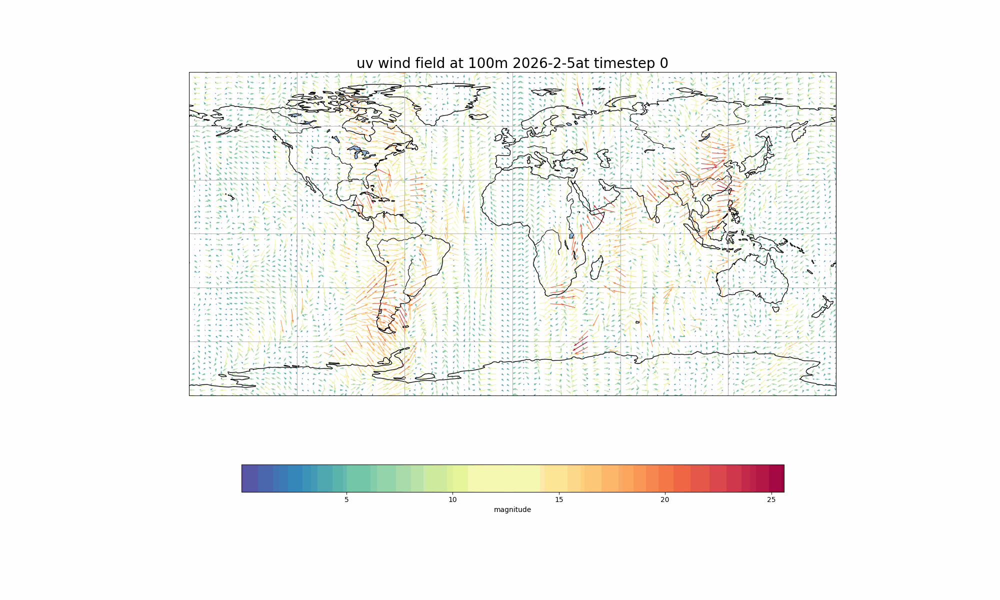
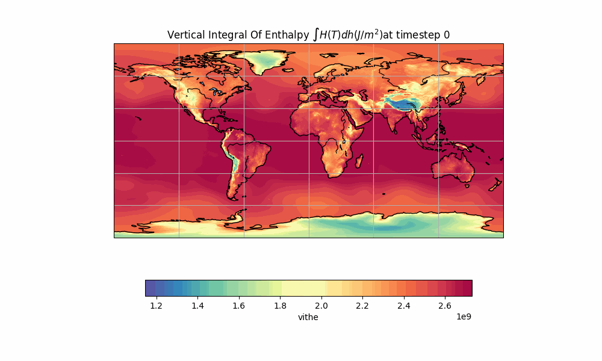

# Visualize 

A *minimal climate data visualizing workflow* for simple animation of scalar field and vector field 

> **Key functionality**: 
>   - Easy slicing : to "zoom in" on local regions
>   - Automatic coarsening of data for plotting vector field 
>   - One-shot animation 
>   - Automated direcotry open/close  
>   - Object-oreinted, organized and readable for personalizing 

## Currently Supported File Format

The workflow currently only support `grib`.  In future it can easily support common xarray based format like `cdf`

## Example 1 

Plot a 2d vector field(24 hour wind field in this example):

``` python    
    output_path = "/data/keeling/a/hytang2/Climate_System_ATMS507/Main/HWs/HW2/outputs"
    data_paths = {
        "u100" : "/data/keeling/a/hytang2/Climate_System_ATMS507/Main/HWs/HW2/data/wind_vector_field/100m_u_component_of_wind.grib",
        "v100" : "/data/keeling/a/hytang2/Climate_System_ATMS507/Main/HWs/HW2/data/wind_vector_field/100m_v_component_of_wind.grib"
    }
    time_steps = 24
    vs = Visualize(task_name="wind_vector_field", mode='vector', data_paths = data_paths, outputs_dir=output_path, time_steps=time_steps)
    vs.populate_frame(title="uv wind field at 100m 2026-2-5")
    vs.animate_from_frames()
```
### Result 


## Example 2

Plot a scalar field (vertically integrated enthalpy)

```python
    output_path =  "/data/keeling/a/hytang2/Climate_System_ATMS507/Main/HWs/HW2/outputs"
    data_paths = {
        "vithe" : "/data/keeling/a/hytang2/Climate_System_ATMS507/Main/HWs/HW2/data/vertical_integral_thermal_energy/vertical_integral_of_thermal_energy.grib"
    }
    time_steps =83
    vs = Visualize(task_name="vertical_integral_enthalpy", mode='scalar', data_paths = data_paths, outputs_dir=output_path, time_steps=time_steps)
    vs.populate_frame(title=r"Vertical Integral Of Enthalpy $\int H(T) dh (J/m^2)$")
    vs.animate_from_frames()
```
### Result: 




## Install and modify
`git clone ` the repository or simply copy paste the tiny script. 

There is a `requirements.txt` file that includes all dependencies. Just create a virtual environment using it. 


